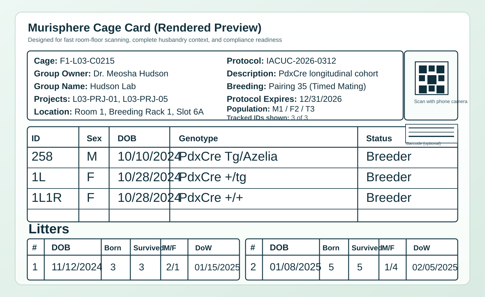

# Murisphere

Murisphere is a browser-based mouse colony and vivarium management SaaS optimized for cage-level speed, data accuracy, and operational simplicity.

Current release: `v0.3.1` (2026-03-05)

## Product Name
`Murisphere`

## GitHub About Message
`Cage-first mouse colony management for modern vivaria: print QR cage cards, scan with any phone, run breeding and compliance workflows, and stay audit-ready.`

## Core Product Capabilities
- Cage-centric workflow with direct scan-to-edit on phone browsers.
- Printable cage cards with server-rendered QR code and CODE128 barcode.
- Colony lifecycle tracking (animals, litters, breeding, weaning, transfers, mortality).
- Facility operations (capacity, quotas, requests, wash workflow, billing/chargeback).
- Compliance stack (protocol expiry hard-stop, deviations, quarantine, audit, signatures).
- Research support (genotyping orders/callbacks, pedigree, planner scenarios, recommendations).

## Cage Card Showcase


Card content includes:
- Cage code and room/rack location.
- Group owner (PI), group/lab name, and linked project codes.
- Protocol number, protocol description, and protocol expiration date.
- Breeding status, cage DOB, and current population counts (M/F/Total).
- Animal table (ID, sex, DOB, genotype, status).
- Litter table (DOB, born, survived, sex split).
- QR code for direct phone-browser scan and barcode for optional scanner workflows.

## Technology
- Backend: Flask + SQLite
- Frontend: responsive HTML/CSS/JS (desktop/tablet/phone)
- Automation: GitHub Actions CI + CD (GHCR Docker publish)

## Quick Start
Option A (`venv`):
```bash
python3 -m venv .venv
source .venv/bin/activate
pip install -r requirements.txt
python3 app.py
```

Option B (`uv`, if installed):
```bash
uv venv
source .venv/bin/activate
uv pip install -r requirements.txt
python3 app.py
```

Open [http://localhost:8000](http://localhost:8000).

## Release Validation Commands
```bash
pip install -r requirements-dev.txt
python3 -m unittest discover -s tests -v
python3 qrcode_diagnostic.py
python3 ui_clickability_audit.py
python3 alert_coverage_verifier.py --db murisphere.db --ensure-schema
python3 cage_card_layout_audit.py
```

Generated artifacts:
- `docs/test_reports/UI_CLICKABILITY_REPORT.html`
- `docs/test_reports/UI_CLICKABILITY_RESULT.json`
- `docs/test_reports/ALERT_COVERAGE_RESULT.json`
- `docs/test_reports/CAGE_CARD_LAYOUT_RESULT.json`

## CI/CD
- `./.github/workflows/ci.yml`
  - Python matrix tests (`3.11`, `3.12`)
  - Backend compile checks
  - Frontend JS syntax checks
- `./.github/workflows/cd.yml`
  - Builds and publishes `ghcr.io/<owner>/murisphere` on `main`

## Demo Data and Scale
Seed a realistic environment:
```bash
python3 seed_large_demo.py
```

Seed profile:
- 20 labs
- 3,000 cages
- 2-6 projects per lab
- Variable lab sizes (small/medium/large tiers)

## Demo Users
- Admin: `admin@murisphere.local` / `admin1234`
- Technician: `tech@murisphere.local` / `tech1234`
- PI: `pi@murisphere.local` / `pi1234`

## Documentation
- [Documentation index](docs/DOCUMENTATION_INDEX.md)
- [User guide](docs/USER_GUIDE.md)
- [Workflow coverage matrix](docs/WORKFLOW_COVERAGE_MATRIX.md)
- [API reference](docs/API_REFERENCE.md)
- [Security and compliance](docs/SECURITY_COMPLIANCE.md)
- [Testing strategy](docs/TESTING_STRATEGY.md)
- [Deployment runbook](docs/DEPLOYMENT_RUNBOOK.md)
- [Operations runbook](docs/OPERATIONS_RUNBOOK.md)
- Tutorial HTML: `docs/tutorial/user_training_tutorial.html`
- Tutorial PDF: `docs/tutorial/user_training_tutorial.pdf`
- Release notes:
  - [v0.2.0](docs/releases/v0.2.0.md)
  - [v0.3.0](docs/releases/v0.3.0.md)
  - [v0.3.1](docs/releases/v0.3.1.md)

## Notes
- QR/barcode card assets are rendered server-side to avoid client CDN failures in restricted networks.
- For enterprise deployment, move from SQLite to PostgreSQL and add SSO/OIDC, rate limiting, and security header policy at ingress.
