# Purpose
This tutorial is designed for **self-paced learning**. It teaches Murisphere as an operational system and as a biological thinking tool.

Inside Murisphere, the landing dashboard now includes a **Start Learning** section. Use it to launch this tutorial, open the PDF, and jump into seeded example workflows directly from the app.
You can also mark modules complete there, so self-paced learning survives across sessions on the same device/browser.

The goal is not only to click through screens. The goal is to learn how a mouse colony actually behaves over time:

- how breeding status changes what a technician should do next
- how strain and genotype shape experimental meaning
- how litter survival, sex balance, and timing affect research supply
- how compliance and welfare workflows protect both animals and science

The core operating rule remains simple:

**Print the cage card -> scan the QR with a phone -> open the cage in the browser -> complete the task immediately.**

# How To Use This Tutorial
You can complete the entire guide in one sitting or in short modules.

## Suggested learning pace
- **Quick orientation:** 20-30 minutes
- **Technician essentials:** 45-60 minutes
- **Biology and breeding module:** 30-45 minutes
- **Research support and planning module:** 30-45 minutes
- **Manager and compliance module:** 30-45 minutes

## Best practice for self-paced learning
1. Work in a dedicated training database, not in your production database.
2. Keep the tutorial open on a laptop or tablet while scanning and editing on a phone.
3. Pause after each module and complete the short exercise before moving on.
4. Treat the screenshots as orientation, not as a substitute for touching the workflow yourself.

# Training Environment and Data Readiness
## Recommended training command sequence
Use the tutorial-ready seed, not the plain scale-only seed.

```bash
python3 -m venv .venv
source .venv/bin/activate
pip install -r requirements.txt
./.venv/bin/python seed_tutorial_demo.py --db training_demo.db --force
MURISPHERE_DB=training_demo.db ./.venv/bin/python app.py
```

## What the tutorial-ready seed gives you
The tutorial seed is deterministic and creates a stable practice environment with:

| Category | Ready at start |
|---|---:|
| Labs | 20 |
| Cages | 3,000 |
| Projects | 73 |
| Animals | 372 |
| Litters | 48 |
| Breeding pairs | 48 |
| Sample records | 48 |
| Planner scenarios | 6 |
| Alert-driving tasks | 80 |

The seeded environment also includes:
- variable lab sizes: 8 small, 8 medium, 4 large
- strong cage-status diversity: `Breeding`, `Timed Mating`, `Holding`, `Wean Pending`
- active welfare and compliance pressure: overdue tasks, protocol deviations, necropsy items, and open vet cases
- pedigree-ready families with sire, dam, and pups linked together
- sample chain-of-custody states from `collected` through `resulted`

## Training accounts
- Admin: `admin@murisphere.local` / `admin1234`
- Technician: `tech@murisphere.local` / `tech1234`
- PI: `pi@murisphere.local` / `pi1234`

## Recommended example records used in this tutorial
These records are seeded intentionally so a learner can follow specific examples.

| Workflow | Example |
|---|---|
| Breeding cage with litter and pedigree | `F1-L01-C0006` |
| Breeding cage with a larger pup set | `F1-L01-C0008` |
| Sample chain-of-custody example | `SMP-0004` on `F1-L01-C0012-P01` |
| Planner scenario example | `Neurogenetics Lab Cohort Plan` |
| Lab for beginner exercises | `Neurogenetics Lab` |

# Mouse Colony Biology Primer
This section is here so a new learner can understand **why** Murisphere tracks what it tracks.

## Why mouse colony data matters biologically
A colony is not just inventory. It is a living, time-dependent system.

- A breeding delay changes when pups are available for experiments.
- A poor litter survival trend can signal husbandry, genetic, or maternal issues.
- A skewed sex ratio can make it hard to hit a study design target.
- A genotype mismatch can invalidate an experimental cohort.
- An expired protocol or unresolved welfare issue can halt work entirely.

Murisphere helps teams see those facts early, while the colony is still manageable.

## Key biological terms
| Term | What it means | Why the software tracks it |
|---|---|---|
| Strain | The genetic background, such as `C57BL/6J` or `BALB/c` | Background strain changes phenotype, breeding behavior, and interpretation |
| Genotype | The allele combination carried by the animal | Determines whether an animal fits the project need |
| `WT/WT` | Wild-type at the tracked locus | Often a control or non-carrier |
| `Cre/+` or `+/tg` | Heterozygous carrier of a transgene or driver | Common in conditional breeding strategies |
| `fl/fl` | Homozygous floxed allele | Often paired with a Cre driver to generate tissue-specific knockouts |
| Timed mating | Breeder setup with a known breeding window | Makes plug checks and embryo timing meaningful |
| Plug check | Inspection for a vaginal plug after mating | Helps estimate embryonic age and downstream harvest timing |
| Litter | A birth event and its pups | Core unit for survival, genotype yield, and weaning workload |
| Weaning | Separation of pups from dam at the appropriate age | A high-frequency operational milestone |
| Pedigree | Parent-child lineage relationships | Needed for breeding strategy and genotype interpretation |
| Necropsy | Post-mortem examination | Important for welfare review and root-cause learning |

## Why cage-centric work wins in real vivaria
Technicians act on **cages**, not spreadsheets.

A good cage workflow should answer these questions immediately:
- Where is the cage?
- Who owns it?
- Which protocol covers it?
- What is in it biologically?
- What is the next action?
- Is anything abnormal or blocked?

That is why Murisphere centers the cage card and QR scan workflow.

# Learning Map
## Module 1: Orientation and safe setup
Learn the dashboard, training users, and printing/scanning rules.

## Module 2: Cage card literacy
Learn how to read a cage card as both an operational label and a biological summary.

## Module 3: Scan-to-edit and audit trail
Learn the phone workflow that matters most for daily technician work.

## Module 4: Breeding, litters, and pedigree
Learn how breeders become litters, how litters become animals, and how lineage affects decisions.

## Module 5: Samples, genotyping, and research readiness
Learn how samples move from collection to result and why that matters for project supply.

## Module 6: Compliance, welfare, and abnormal conditions
Learn how to recognize and respond to alerts that protect animal welfare and scientific quality.

## Module 7: Planner and manager workflows
Learn how colony operations connect to project demand, cage space, and facility risk.

# Module 1. Orientation and Safe Setup
## Learning goal
Be able to log in, identify the main views, and prepare a phone-reachable QR workflow.

## Steps
1. Log in as the technician.
2. Pause on the landing dashboard before clicking anywhere else.
3. In the `Start Learning` panel, open the full tutorial once so you know where it lives in the app.
4. Note the alert count, room pressure, and overdue workload.
5. Open the cage card center.
6. Confirm `Scan Base URL` points to a host your phone can reach.
7. Print one test card at **100% scale**.
8. Scan the QR with your phone camera.
9. Confirm the cage opens directly in the browser.

## Why this matters biologically
Bad scan setup causes delayed data entry. Delayed data entry turns real biological events into memory-based guesses.

That is especially risky for:
- plug checks
- birth timing
- weaning date
- mortality and welfare observations

## Exercise
- Log in as technician.
- Find the dashboard tile that would make you investigate first.
- Write down why that item would change your room order.

# Module 2. Cage Card Literacy
## Learning goal
Read a cage card as an at-a-glance biological and operational summary.

## Recommended example
Use cage `F1-L01-C0006`.

## What to look for on the card
- cage code and location
- lab ownership and linked projects
- protocol number and expiration context
- strain and genotype summary
- breeding status
- full population counts (`M/F/T`)
- tracked animal rows
- litter rows including `DoW` when present

## Biology background
A cage card is a compressed biological story.

For `F1-L01-C0006`:
- `Rosa26-LSL` tells you the background line is designed for conditional activation or deletion studies.
- `fl/fl` tells you both alleles are floxed.
- `Breeding` tells you this cage is producing future animals, not merely holding existing ones.
- a litter row tells you there is recent reproductive output to evaluate.

## Exercise
1. Open `F1-L01-C0006`.
2. Compare the card-level genotype summary to the animal-level genotypes.
3. Ask yourself: if this cage were for a conditional knockout study, which additional genotype information would a researcher still need before assigning animals to an experiment?

# Module 3. Scan-To-Edit and Audit Trail
## Learning goal
Perform the main technician workflow quickly and correctly on a phone.

## Steps
1. Print or open the card for `F1-L01-C0006`.
2. Scan the QR with the phone camera.
3. Confirm the browser opens to the correct cage.
4. Add a note such as `Tutorial note - verified scan workflow`.
5. Save.
6. Open the audit history and verify the note was captured with the right user and time.

## Why this matters biologically
If room edits happen later at a desk, the risk rises that you lose precise observation timing.

Examples:
- a plug seen today but entered tomorrow is already lower-quality data
- a welfare observation entered late is harder to interpret and escalate
- a litter note entered from memory may miss real survival changes

## Exercise
Repeat the scan workflow for `F1-L01-C0008` and compare how many taps it takes from card to saved update.

# Module 4. Breeding, Litters, and Pedigree
## Learning goal
Understand how Murisphere represents reproduction over time and why that matters.

## Recommended examples
- Breeding cage: `F1-L01-C0006`
- Larger litter example: `F1-L01-C0008`
- Sample-linked pup: `F1-L01-C0012-P01`

## Biology background
A good breeding record answers four questions:
1. Which animals were paired?
2. When did the breeding window start?
3. Was there evidence of mating or pregnancy?
4. What was the output: litter size, survival, sex mix, and genotype yield?

In real colony management, breeder productivity is not just a convenience metric. It directly affects:
- experimental timelines
- cage pressure
- animal cost
- whether older breeders should be retired or replaced

## What the seeded tutorial data includes
- 48 breeding pairs with named sire and dam records
- 48 litters
- parent-linked pups for pedigree viewing
- breeding events such as timed mating and plug checks

## Guided walkthrough
1. Open `F1-L01-C0006`.
2. Review the litter row and note the birth date and survival.
3. Open the animal list and identify the sire, dam, and pups.
4. Open the pedigree for `F1-L01-C0006-P01`.
5. Observe that the pup links back to both seeded parents.
6. Open breeding pair productivity for the cage and note how litter output connects to operational decisions.

## Exercise
Compare `F1-L01-C0006` and `F1-L01-C0008`.

Questions to answer:
- Which cage currently has the larger effective breeding output?
- Which one would you prioritize if a project urgently needed genotype-confirmed pups?
- What extra information would help you decide whether to keep the pair active?

## Fun application
Imagine you are supporting a neuroscience lab that needs a balanced-sex cohort of conditional animals in four weeks.

Using these cages, decide:
- whether current breeder output seems sufficient
- whether a new breeding pair should be started now
- whether weaning pressure will become the real bottleneck before genotype confirmation does

# Module 5. Samples, Genotyping, and Research Readiness
## Learning goal
See how colony records connect to molecular confirmation and project assignment.

## Recommended examples
- `SMP-0001` on `F1-L01-C0006-P01`
- `SMP-0004` on `F1-L01-C0012-P01`

## Biology background
A colony is only useful to research when the right animals can be identified confidently.

Genotyping helps answer:
- Is the animal a carrier, homozygote, or wild-type control?
- Is the animal appropriate for breeding, experiment, or exclusion?
- Are observed genotype ratios biologically plausible?

Sample tracking matters because a genotype result without chain-of-custody confidence is weaker evidence.

## What to observe
The tutorial seed includes sample records in multiple states:
- `collected`
- `shipped`
- `received`
- `resulted`

That lets you learn the process as a pipeline instead of a single field.

## Guided walkthrough
1. Open the `Reports` tab and use the **Samples & Genotyping Workspace**.
2. Pause at the overview cards first and identify which provider has the highest pending load.
3. Open the provider preset cards and apply one that matches your workflow.
4. Locate `SMP-0004`.
5. Confirm it belongs to `F1-L01-C0012-P01`.
6. Review the event history from collection to result.
7. Compare it to `SMP-0001`, which is still only `collected`.
8. Create or open a genotyping order that includes one of those samples.
9. Download the provider template CSV for that order.
10. Open the order reconciliation view and note how it distinguishes `ready to ship`, `in transit`, `with provider`, `missing result`, and `resulted`.
11. Inspect the **Project Cohort Readiness** panel and find which project has the largest assignment deficit.
12. Apply a built-in cohort template, or add a genotype target rule for the selected project, for example `Cre/+` or `fl/*`.
13. Optionally save the current rule set as a reusable lab template for the next project that needs the same design.
14. In **Assignment Candidates**, open one genotype-ready animal and confirm whether it matches the target rule.
15. Select one or more matching animals and reserve them into the project cohort.
16. Move one selected animal from `reserved` to `assigned` and inspect the **Assignment Flow** chart plus the recent assignment activity log.
17. Review **Breeder Decisions** and decide whether the active pair should keep producing, pause soon, or be reviewed for low output.
18. If you are practicing as an admin, import a result CSV or use callback simulation and watch the order move toward completion.

## Exercise
Choose one `resulted` sample and one `collected` sample.

Write down:
- which one is research-ready now
- which one still carries operational risk
- what the next handoff should be
- whether the provider workflow is blocked by shipping, provider receipt, or missing result reconciliation
- which project could use that animal first and whether breeder output should continue to meet demand
- whether the animal actually matches the project's genotype target rule before you reserve it

## Fun application
Pretend a PI needs to start a pilot cohort tomorrow. Your job is to identify which animals are closest to assignment.

Use sample status, genotype results, provider reconciliation, and cage context together. This is how good colony software becomes a research acceleration tool rather than a record archive.

# Module 6. Compliance, Welfare, and Abnormal Conditions
## Learning goal
Respond to alerts in a way that is biologically meaningful and operationally disciplined.

## What the training data guarantees
The tutorial dataset includes:
- expired-protocol alerts
- overdue task alerts
- open protocol deviations
- necropsy-pending mortality records
- open vet cases

## Why this matters biologically
An abnormal condition is not just an administrative inconvenience.

It may indicate:
- an unperformed required action
- a welfare problem
- a quality problem in the breeding program
- a compliance block that can invalidate downstream work

## Guided walkthrough
1. Open the landing dashboard as the technician.
2. Open the alert feed.
3. Filter by high severity.
4. Open one protocol deviation and one vet case.
5. Identify what information is missing before closure would be defensible.
6. Acknowledge one alert and note the state change.

## Exercise
The seeded dataset contains both `high` and `moderate` deviations.

Practice triage by answering:
- Which conditions need immediate room action?
- Which need documentation and owner assignment?
- Which should stop breeding or experimental assignment until resolved?

## Fun application
Treat this as a case-based learning session:
- a welfare concern appears in one cage
- a necropsy is pending in another
- a protocol deviation exists in the same lab

Ask whether these are independent events or a pattern worth escalating.

# Module 7. Planner, Capacity, and Facility Thinking
## Learning goal
Understand how colony data supports forecasting and facility-level decisions.

## Recommended example scenarios
- `Neurogenetics Lab Cohort Plan`
- `Synaptic Circuits Group Cohort Plan`
- `Behavioral Neuroscience Team Cohort Plan`

## Biology background
Research demand planning is really a timing problem.

You need to know:
- how many animals are active now
- how many litters are likely soon
- whether breeder output can meet the needed-by date
- whether cage space can absorb that plan without stressing the facility

## Guided walkthrough
1. Open the `Analytics` tab and use the planner workspace under the charts.
2. Start with `Neurogenetics Lab Cohort Plan`.
3. Review needed-by date, target animals, and linked projects.
4. Review the generated risk level and projected deficit.
5. Compare it with `Behavioral Neuroscience Team Cohort Plan`, which requests more animals.
6. Ask whether the limiting factor is breeders, cages, or time.

## Exercise
Pick two planner scenarios and answer:
- Which one is the higher operational risk?
- Which one is the better candidate for immediate breeder expansion?
- Which one might be solved by better project prioritization instead of more cages?

## Fun application
Pretend your institute just approved a new pilot study. Use Murisphere to estimate whether the colony can support it **without** compromising existing commitments. This is the bridge between facility management and scientific program management.

# Role-Based Learning Paths
## Technician path
If you have only 45 minutes:
1. Module 1
2. Module 2
3. Module 3
4. Module 6

## PI / Researcher path
If your focus is study readiness:
1. Mouse Colony Biology Primer
2. Module 4
3. Module 5
4. Module 7

## Facility manager path
If your focus is operational control:
1. Module 1
2. Module 6
3. Module 7
4. Review the visual walkthrough sections for dashboard and compliance views

# Visual Walkthrough
## Login Screen
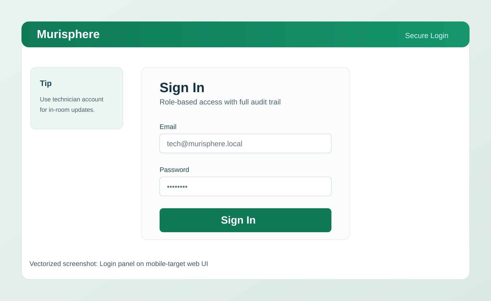{ width=95% }
Use the seeded tutorial database so the examples in this guide match what you see.

## Landing Dashboard, Cage Alerts, and Density View
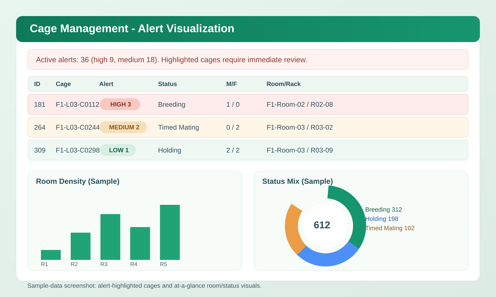{ width=95% }
Use this view first every session. It teaches prioritization, not just navigation.

## Cage Card Center and Batch Printing
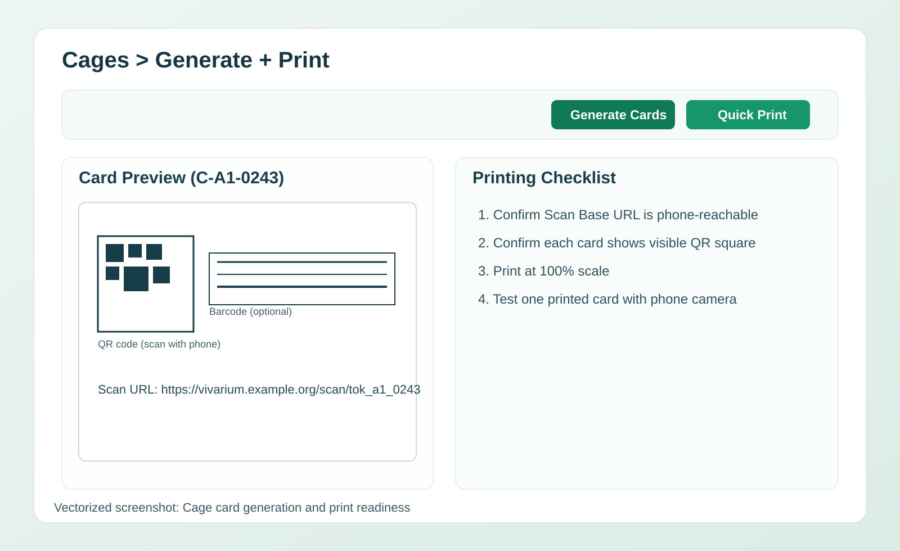{ width=95% }
The tutorial workflow begins with correct print setup.

## Complete Cage Card
{ width=95% }
Population is the cage-level total. The animal and litter rows explain where that population came from biologically.

## Scan Base URL Setup
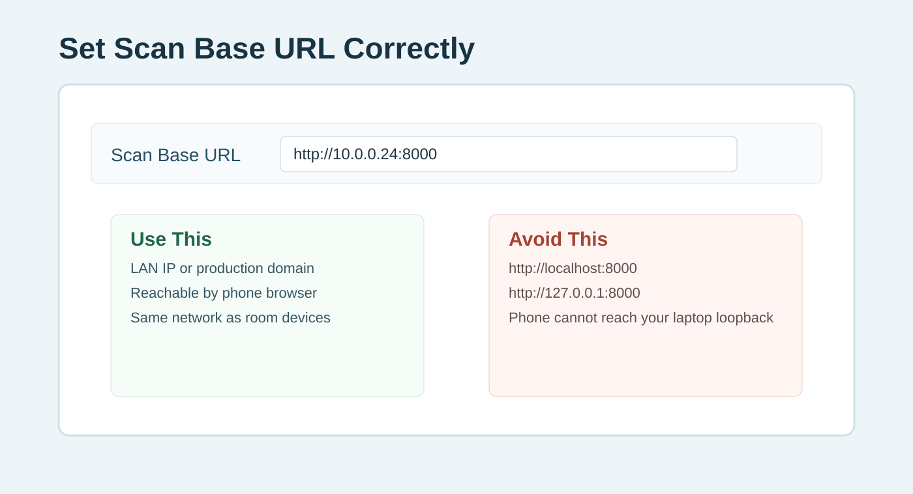{ width=95% }
A perfect QR image still fails operationally if it points to the wrong host.

## Phone Camera Scan of Printed QR
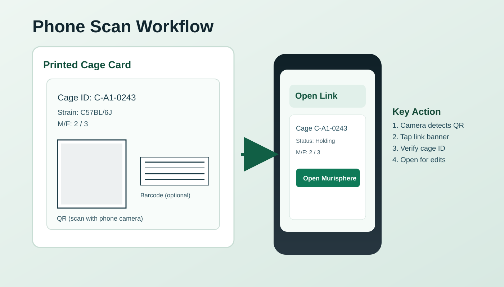{ width=95% }
The phone should open the browser directly. No mobile app is required.

## Scan-to-Edit Cage Workflow
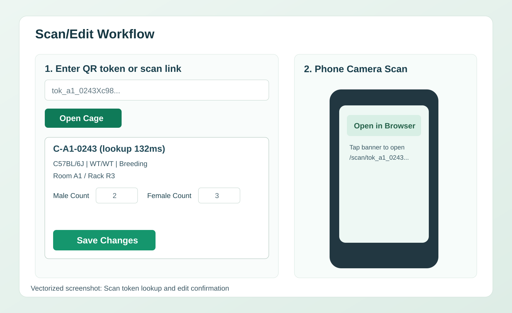{ width=95% }
This is the most important high-frequency workflow in the product.

## Breeding Pair Productivity
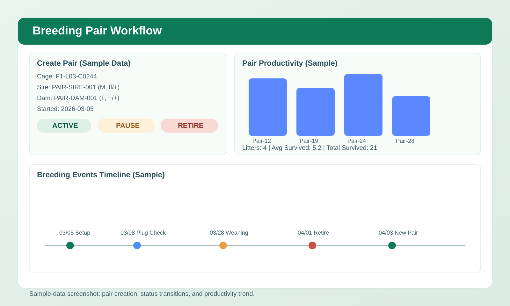{ width=95% }
Use this after learning the breeding and litter modules.

## Samples and Genotyping Workflow
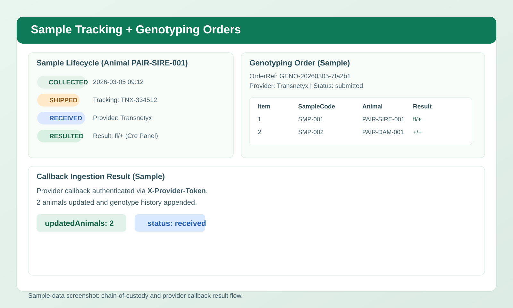{ width=95% }
This connects colony operations to actual research assignment.

## Recommendations and Outcomes
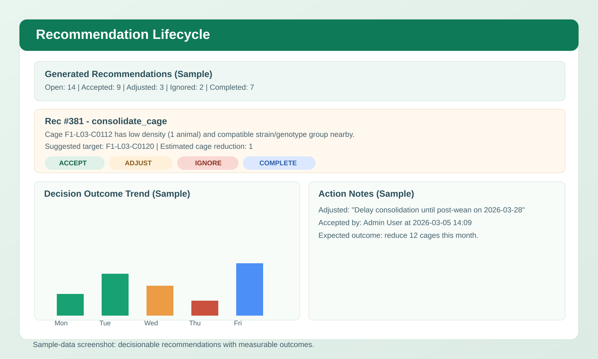{ width=95% }
Use recommendations as discussion starters, not autopilot.

## Planner Scenario Evaluation
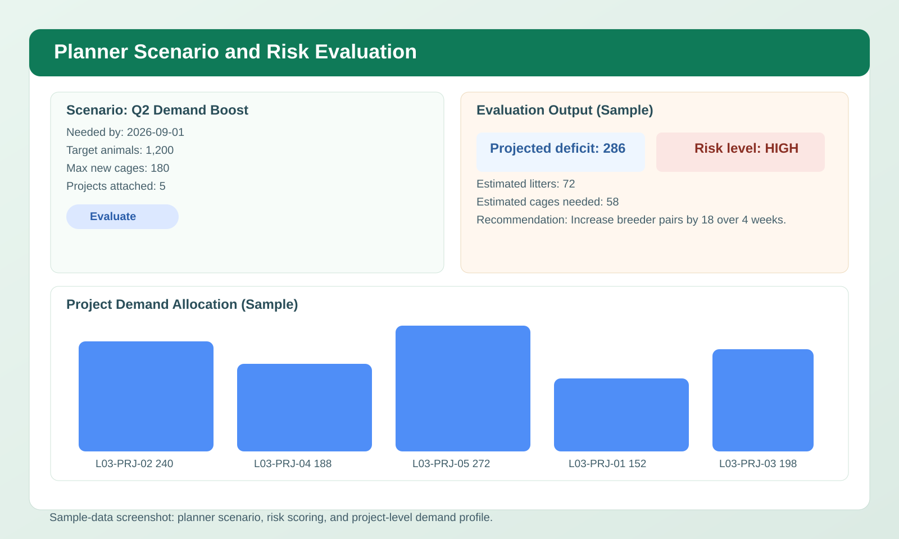{ width=95% }
Good planners help labs avoid both shortages and avoidable cage growth.

## Compliance Dashboard
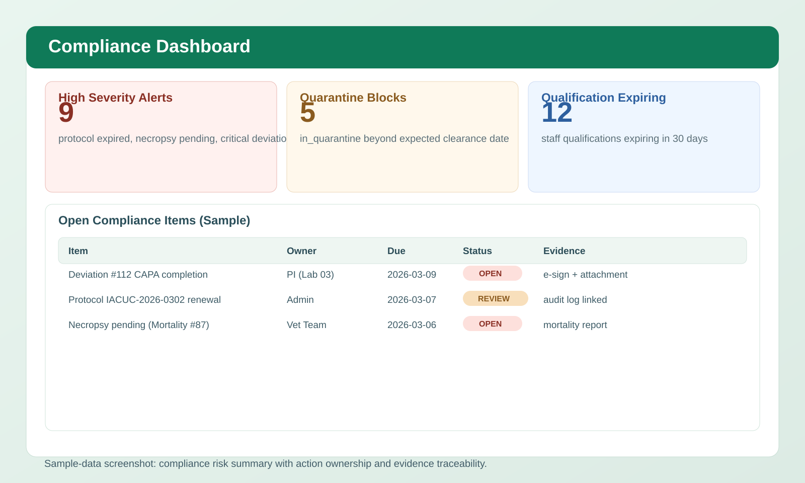{ width=95% }
The best compliance workflow is fast, visible, and routine.

## Pedigree Explorer
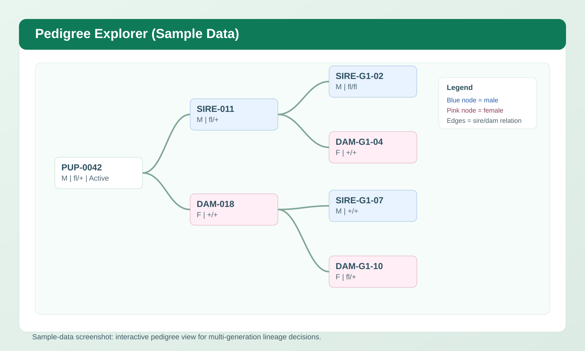{ width=95% }
Pedigree is where breeding history becomes biologically interpretable.

## Scan Troubleshooting Reference
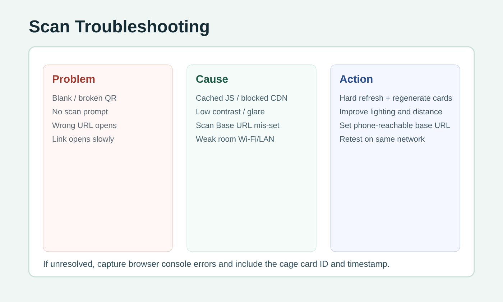{ width=95% }
Keep this reference near any cage-card printing station.

# Mini Missions You Can Learn Together
These are good for paired learning, onboarding, or team huddles.

## Mission 1: Rescue a delayed cohort
A lab needs animals in four weeks. Use `Neurogenetics Lab Cohort Plan` and the breeder cages in lab 1 to decide whether current supply is enough, which genotype template best fits the study, and whether any reserved animals are already stuck in `assigned` or `shipped`.

## Mission 2: Find the highest-risk welfare pattern
Review high-severity alerts and decide whether the issue is isolated or repeated across one lab or room.

## Mission 3: Trace inheritance from card to pedigree
Start at `F1-L01-C0006`, open a pup, and follow the lineage back to sire and dam.

## Mission 4: Choose a sample that is experiment-ready
Compare `SMP-0001` and `SMP-0004`. Explain why one is still operationally incomplete.

## Mission 5: Explain a genotype to a new trainee
Use a real seeded example such as `fl/fl`, `Cre/+`, or `WT/WT` and explain what experiment or breeding decision it could support.

# Glossary for New Learners
- **Breeder productivity:** how effectively a pair or cage generates usable litters over time
- **Cohort:** a group of animals assembled for one experimental purpose
- **Conditional allele:** an allele designed to change function only under a specific genetic trigger such as Cre
- **Hard-stop:** a workflow block that prevents action until a compliance problem is fixed
- **Pedigree:** parent-child lineage map
- **Protocol deviation:** a documented departure from approved procedure or protocol expectations
- **Self-paced learning:** a training style in which the learner can stop after any module and resume later without losing context

# End-of-Shift and End-of-Day Checklists
## Technician
1. Confirm all queued writes are synced.
2. Confirm new notes, welfare events, and mortality records are saved.
3. Close open room tasks or hand them off.
4. Leave a clear audit trail for anything unresolved.

## PI / Facility Manager / Admin
1. Assign owners for high-severity alerts.
2. Review scenario risk that may affect study timing.
3. Review unresolved deviations and necropsy items.
4. Export any summaries needed for handoff, audit, or PI discussion.

# Troubleshooting and Learning Support
- **The QR opens the wrong host:** fix `Scan Base URL`, then reprint cards.
- **The phone camera does not react:** improve lighting, flatten the card, and scan the QR square rather than the 1D barcode.
- **The tutorial data does not match this guide:** reseed with `seed_tutorial_demo.py --db training_demo.db --force` and relaunch the app with `MURISPHERE_DB=training_demo.db`.
- **You cannot find pedigree/sample/planner examples:** you are probably using the scale-only seed instead of the tutorial-ready seed.
- **A workflow feels biologically confusing:** return to the Mouse Colony Biology Primer, then repeat the module using a named example cage.
- **You are training with another person:** read the exercise question aloud before clicking the next screen. Murisphere becomes much easier to understand when the biological reason for each action is spoken, not just performed.
